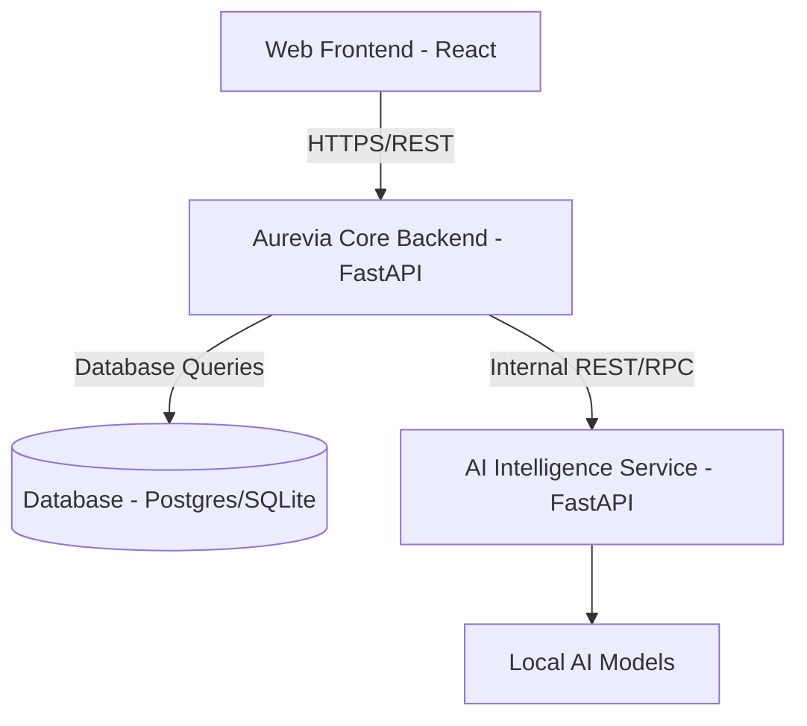
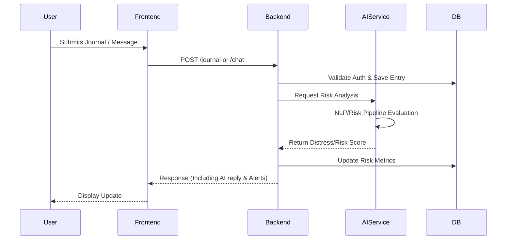

# System Architecture

Aurevia implements a microservices-based architecture to provide a resilient, scalable, and responsive mental health monitoring and distress prediction system.

> **Disclaimer:** Aurevia is a decision-support and monitoring system. It is **not** a replacement for qualified mental-health professionals or emergency services.

## System Overview

The system is separated into three main layers:
1. **Frontend (React)**: The client-facing application handling user interactions.
2. **Core Backend (FastAPI)**: Manages business logic, user authentication, data persistence, and chat interactions.
3. **AI Service (FastAPI)**: Dedicated intelligence layer handling text analysis, risk evaluation, and audio processing.

## Major Components

### Frontend
- **Framework**: React 19, TypeScript, Vite.
- **Styling & UI**: Tailwind CSS, Radix UI.
- **State Management**: Zustand, React Query for API data fetching.
- **Visualizations**: Recharts, Leaflet.

### Backend (Core API)
- **Framework**: Python 3.12, FastAPI.
- **Database**: Relational Database via SQLAlchemy and Alembic. Supports SQLite for development and PostgreSQL for production.
- **Authentication**: JWT access tokens and password hashing via Passlib (bcrypt).

### AI Service
- **Framework**: Python 3.12, FastAPI.
- **AI/NLP Pipeline**: Uses Hugging Face Transformers for Natural Language Processing. Analyzes text for distress prediction.
- **Audio Pipeline**: Extracts audio features and transcribes audio securely.
- **Model Management**: Supports loading large AI models into memory safely with a fallback to a fast Demo mode for development.

## Data Flow & Request/Response Flow

## Pipeline Details

### Authentication
Implemented via a secure `/auth/login` and `/auth/register` flow yielding standard JWT bearer tokens, which authorize requests across the core backend.

### AI/NLP Pipeline
Implemented in the `ai-service/app/nlp/` and `ai-service/app/intelligence/` directories. Extracts sentiment and computes distress scoring via dedicated endpoints. Features a fast demo mode and a real model mode (see `MODEL_SETUP.md`).

### Audio Pipeline
Implemented in the `ai-service/app/audio/` directory. Enables robust processing of auditory inputs for feature extraction.

### Caching and Workers
The `aurevia-backend` contains a `cache` directory to facilitate short-term memory caching and worker tasks, preparing the ground for more robust message queues (like Redis/Celery) in the future.

## Current State vs. Planned Features

**Implemented:**
- React/TypeScript Frontend UI.
- Core FastAPI Backend with JWT Auth, Journaling, and AI Chat routing.
- SQLite/PostgreSQL Database Integration via SQLAlchemy.
- Dedicated AI Service FastAPI microservice.
- NLP Text Pipeline (Demo & Real Modes).
- Audio feature extraction pipeline.

**Planned/Future:**
- Redis and Celery integration for heavy asynchronous background processing.
- Real-time WebSocket functionality for chat streaming and live notifications.
- Advanced clustering and distributed deployment topologies.
