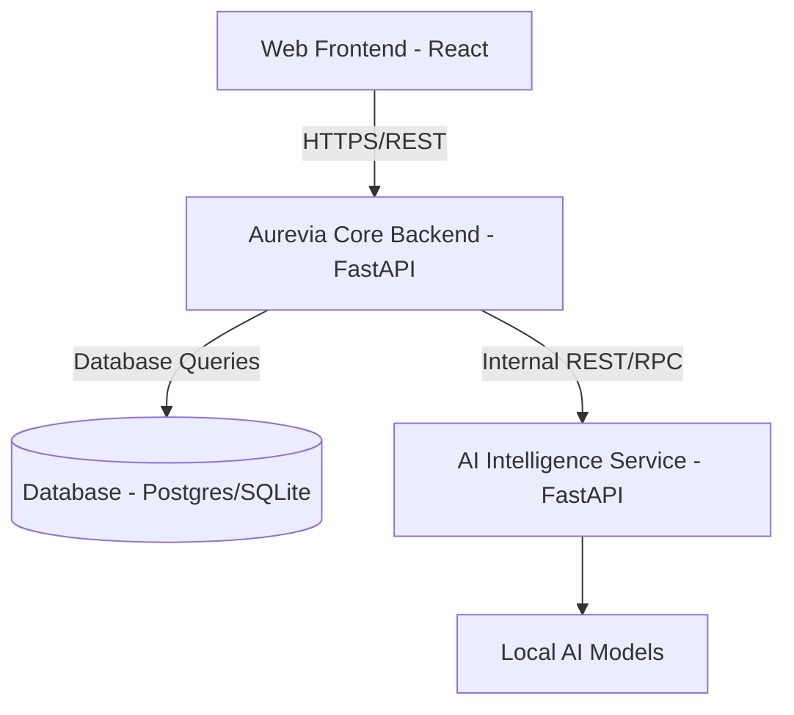
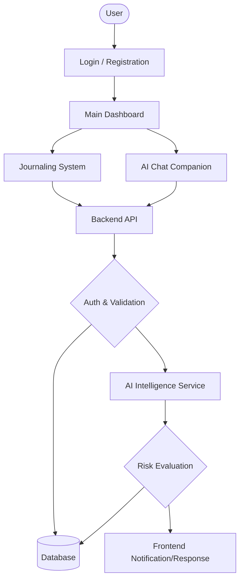

# Aurevia

AI-Powered Dynamic Mental Health Monitoring and Distress Prediction System for Victims of Atrocities.

**Hackathon Context:** Built as part of CodeSprint 2026.

> **Disclaimer:** Aurevia is a decision-support and monitoring system. It is **not** a replacement for qualified mental-health professionals or emergency services.

## Problem Statement
- **Problem Statement ID:** 26094
- **Organization:** Ministry of Social Justice and Empowerment (MoSJE)
- **Department:** Department of Social Justice and Empowerment
- **Category:** Software
- **Theme:** MedTech / BioTech / HealthTech

### Overview
Aurevia addresses the critical need for mental health monitoring and distress prediction for vulnerable populations, including:
- Victims of rape and gang rape
- Victims of murder, grievous hurt, and arson
- Witnesses facing intimidation or threats
- Families affected by caste-based violence
- Beneficiaries receiving relief, compensation, rehabilitation, and protection under the Scheduled Castes and Scheduled Tribes (Prevention of Atrocities) Act, 1989.

## Our Solution
Aurevia provides an intelligent companion, automated case prioritization, and real-time risk alerts to empower support workers and provide a safe space for victims. It utilizes a secure backend, an AI-powered intelligence service, and a responsive frontend to deliver a comprehensive monitoring system.

## ✨ Features
- **Secure Authentication & Profiling:** JWT-based secure access for users and caseworkers.
- **Journaling & Mood Tracking:** Users can safely log their thoughts and feelings.
- **AI Chat Companion:** Conversational support with a built-in safety layer.
- **AI Intelligence Service:** Advanced NLP analysis, distress prediction, and audio feature extraction.
- **Real-Time Risk Alerts & Automated Prioritization:** Identifying high-risk cases for immediate review.

## Architecture

Aurevia is composed of a microservices architecture separating the core backend, AI intelligence, and frontend UI.



## Navigation Graph



## Tech Stack
- **Frontend:** React 19, TypeScript, Vite, Tailwind CSS, Zustand, React Query, Recharts, Leaflet.
- **Backend Core:** Python 3.12, FastAPI, SQLAlchemy, Alembic, SQLite/PostgreSQL, JWT, Passlib.
- **AI Service:** Python 3.12, FastAPI, Transformers (Hugging Face), PyTorch.

## 📁 Folder Structure

```
Aurevia/
├── ai-service/             # AI Intelligence Layer (NLP, Audio, Risk Prediction)
│   ├── app/
│   │   ├── api/            # API endpoints
│   │   ├── audio/          # Audio pipeline
│   │   ├── core/           # Configuration
│   │   ├── intelligence/   # Prediction & ML logic
│   │   ├── models/         # Model management and downloading
│   │   ├── nlp/            # Text analysis pipeline
│   │   ├── schemas/        # Pydantic schemas
│   │   └── storage/        # Storage management
│   ├── data/               # Local data/caches
│   └── tests/              # AI service tests
├── aurevia-backend/        # Core Backend (Auth, Journal, Chat)
│   ├── alembic/            # Database migrations
│   ├── app/
│   │   ├── api/            # API endpoints
│   │   ├── cache/          # Caching layer
│   │   ├── core/           # Security and config
│   │   ├── db/             # Database connection
│   │   ├── middleware/     # Request logging/error handling
│   │   ├── models/         # SQLAlchemy ORM models
│   │   ├── schemas/        # Pydantic schemas
│   │   ├── services/       # Business logic
│   │   └── tests/          # Backend tests
├── src/                    # Frontend React Source
│   ├── api/                # API integration
│   ├── assets/             # Static assets
│   ├── components/         # Reusable UI components
│   ├── data/               # Mock/static data
│   ├── hooks/              # Custom React hooks
│   ├── lib/                # Utilities
│   ├── pages/              # Application views
│   └── store/              # Zustand state management
├── public/                 # Public static files
├── docs/                   # Documentation files
└── package.json            # Frontend dependencies
```

## Installation & Configuration

### Frontend
```bash
npm install
npm run dev
```

### Core Backend (`aurevia-backend/`)
```bash
cd aurevia-backend
python -m venv venv
source venv/bin/activate
pip install -r requirements.txt
cp .env.example .env
uvicorn app.main:app --reload
```

### AI Service (`ai-service/`)
See the [Model Setup Guide](MODEL_SETUP.md) for detailed configuration, including Demo Mode vs Real AI Mode.
```bash
cd ai-service
python -m venv venv
source venv/bin/activate
pip install -r requirements.txt
cp .env.example .env
uvicorn app.main:app --reload
```

## Project Members and Roles
- **Sayuj:** AI/ML, Database, Audio AI, Object Storage, Notifications
- **Ranak:** Messaging, Cache, Notifications, Workers / Background Processing
- **Bhumika:** Backend and Authentication Security / Backend integration and testing
- **Shinjini:** Frontend
- **Swastika:** Backend and Authentication Security

## Roadmap
See [ROADMAP.md](ROADMAP.md) for completed and future work.

## License
MIT License. See [LICENSE.md](LICENSE.md) for details.
